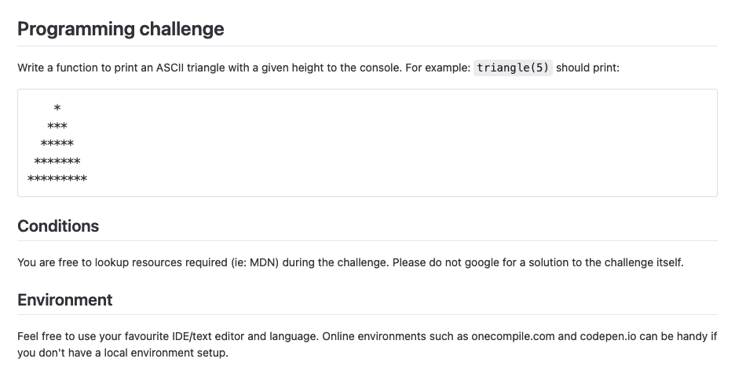
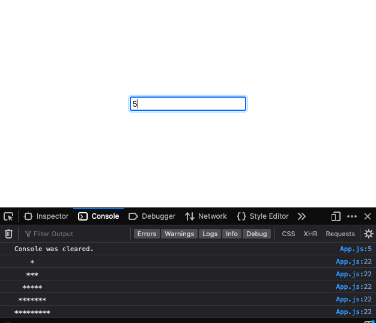

## ASCII Triangle Code Challenge
Application that accepts number as the ascii triangle's height

# Code Challege Instructions


## To run
From your terminal, run the command below
```
npm start
```


## Application Screenshots
Ascii Triangle with heigth of 5


Ascii Triangle with heigth of 10
